<h1 align="center">Partie Backend de l'application web Digital Banking</h1>
 

Ce rapport présente la partie backend d'une application web de gestion des comptes bancaires appelée "Digital Banking". L'application est développée en utilisant le framework Spring Boot, qui offre une structure robuste et facilite le développement d'applications Java.

L'objectif principal de l'application est de permettre la gestion des comptes bancaires pour les clients. Chaque compte bancaire appartient à un client et peut subir plusieurs opérations de type "Débit" ou "Crédit". Il existe deux types de comptes : les comptes courants et les comptes épargne.

## Architecture Backend
La partie backend de l'application Digital Banking suit une architecture en couches, ce qui permet une séparation claire des responsabilités et facilite la maintenance et l'évolutivité de l'application. Les principales couches de l'application backend sont les suivantes :

1. Couche DAO : Cette couche gère l'accès aux données et comprend les interfaces JPA Repository basées sur Spring Data. Ces interfaces fournissent les opérations de base pour interagir avec les entités persistantes.

2. Entités JPA : Les entités JPA représentent les objets métier de l'application et sont mappées aux tables de la base de données. Les entités de l'application Digital Banking sont les suivantes :
   - Customer : Représente un client de la banque.
   - BankAccount : Classe abstraite représentant un compte bancaire. Les sous-classes de BankAccount sont CurrentAccount et SavingAccount.
   - CurrentAccount : Représente un compte courant avec une autorisation de découvert.
   - SavingAccount : Représente un compte épargne avec un taux d'intérêt.
   - AccountOperation : Représente une opération effectuée sur un compte bancaire.

3. Couche service : Cette couche contient la logique métier de l'application et offre des services pour effectuer des opérations sur les comptes bancaires. Elle utilise les interfaces DAO pour accéder aux données et les mappers pour convertir les entités en DTO (Data Transfer Object) et vice versa.

4. DTOs : Les DTOs sont des objets utilisés pour transférer des données entre les différentes couches de l'application. Ils permettent de définir les informations à envoyer ou à recevoir lors des appels API.

5. RestController : Les RestControllers sont des composants qui exposent les services de l'application via des API REST. Ils reçoivent les requêtes HTTP, appellent les services appropriés et renvoient les réponses aux clients.

6. Exceptions métier : Ces exceptions sont utilisées pour gérer les erreurs spécifiques à l'application. Dans l'application Digital Banking, nous avons les exceptions suivantes :
   - CustomerNotFoundException : Lancée lorsque le client n'est pas trouvé.
   - BankAccountNotFoundException : Lancée lorsque le compte bancaire n'est pas trouvé.
   - BalanceNotSufficientException : Lancée lorsque le solde du compte n'est pas suffisant pour effectuer une opération.

<h2>
Ce fichier contient les deux parties du backend
</h2>

 
 
<h3>
Partie 1 : Creation du projet
</h3>
 
<h4>- Use Case Diagram</h4>
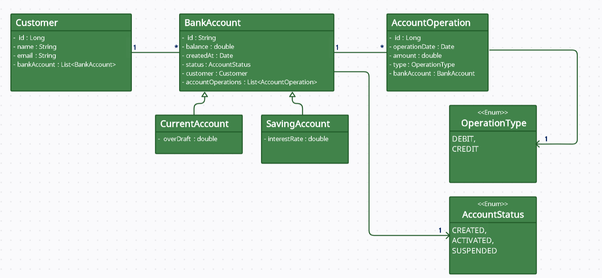
 
     
<h4>- Le Test</h4>
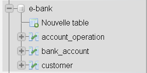
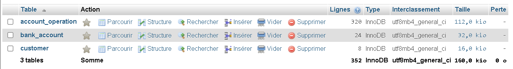
 
 

# - les entités et les interfaces JPA

## Détails techniques
Voici quelques détails techniques importants concernant l'implémentation de l'application Digital Banking :

### @Entity JPA Entities
Les entités JPA de l'application sont annotées avec `@Entity` pour les identifier comme entités persistantes. La classe abstraite `BankAccount` utilise l'annotation `@Inheritance(strategy = InheritanceType.JOINED)` pour spécifier une stratégie d'héritage de type "JOINED". Cela signifie que les sous-classes `CurrentAccount` et `SavingAccount` auront leurs propres tables distinctes, mais seront liées à la table de la classe `BankAccount` par une clé étrangère.

### @Repository
Les interfaces DAO de l'application utilisent l'annotation `@Repository` pour indiquer à Spring qu'il s'agit de composants de persistance qui gèrent l'accès aux données. Ces interfaces étendent les interfaces JPA Repository de Spring Data, telles que `JpaRepository` ou `CrudRepository`, et fournissent des méthodes pour effectuer des opérations de base sur les entités.

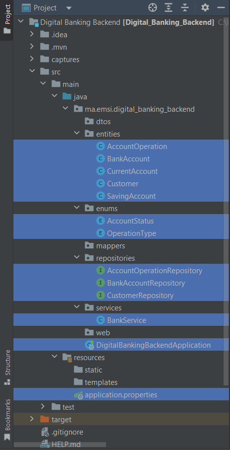
 
 
 

 
<h3>
Partie 2 : Couche service, DTOs et RestController
</h3>
 
 

# - Les couches (dtos, mappers, services, web)

### @Service
Les classes de service de l'application utilisent l'annotation `@Service` pour indiquer qu'elles contiennent la logique métier de l'application. Ces classes utilisent les interfaces DAO pour accéder aux données et effectuer des opérations sur les entités. Elles peuvent également utiliser des mappers pour convertir les entités en DTOs et vice versa.

### @RestController
Les RestControllers de l'application utilisent l'annotation `@RestController` pour indiquer qu'ils sont des composants qui exposent les services de l'application via des API REST. Les méthodes de ces classes sont annotées avec des annotations telles que `@GetMapping`, `@PostMapping`, `@PutMapping`, etc., pour spécifier les points de terminaison des API et les opérations HTTP correspondantes.

### @ExceptionHandler
Les RestControllers utilisent également l'annotation `@ExceptionHandler` pour gérer les exceptions spécifiques à l'application. Ces méthodes sont annotées avec des types d'exception spécifiques, tels que `@ExceptionHandler(CustomerNotFoundException.class)`, et renvoient les réponses d'erreur appropriées aux clients.

 
 
<h4>- BankAccountService.java</h4>
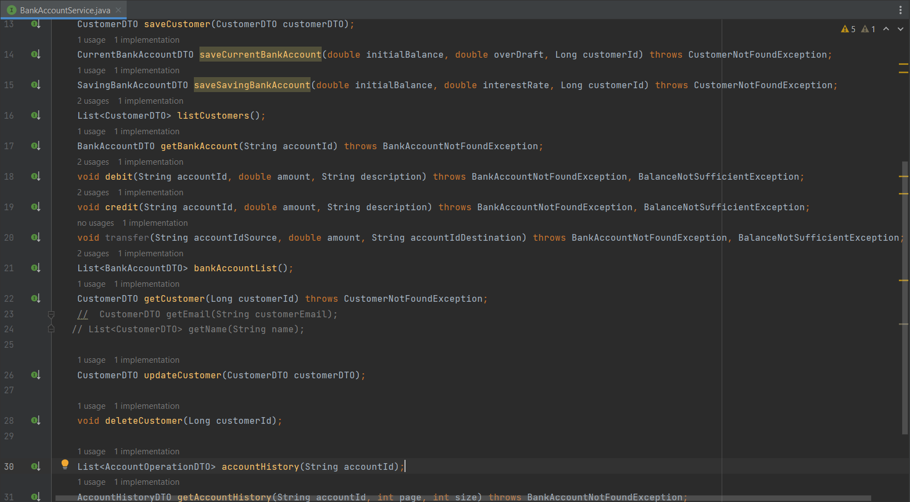
 
 
<h4>- CustomerRestController.java</h4>
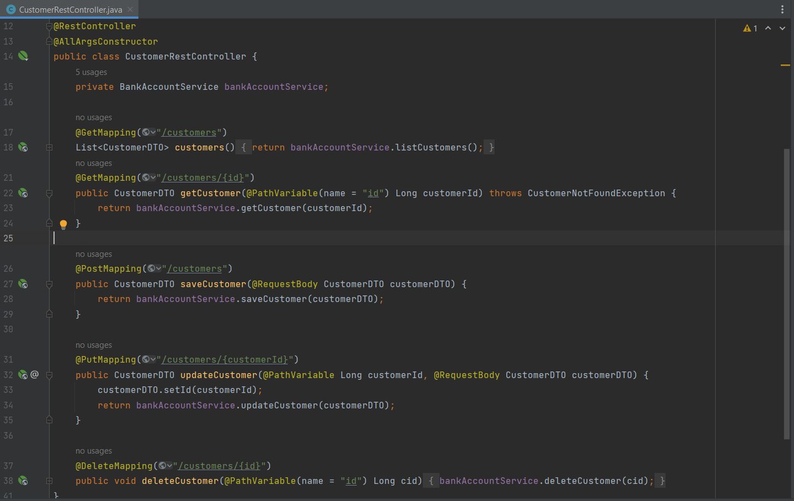
 
 
<h4>- Le Test de la couche web (Customer) :</h4>
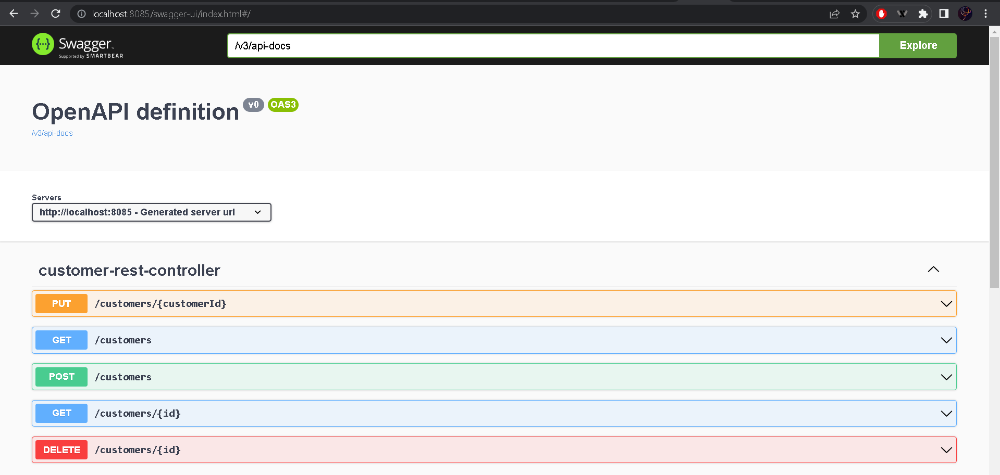
 
 
<h4>- Liste des clients</h4>
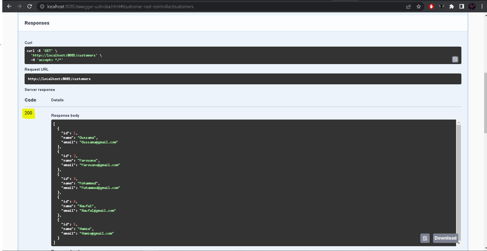
 
 
<h4>- Creer un client</h4>
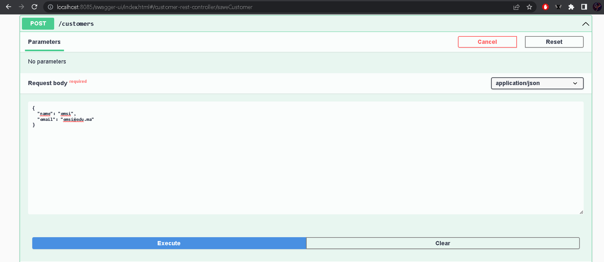
 
 
<h4>- Modifier un client</h4>
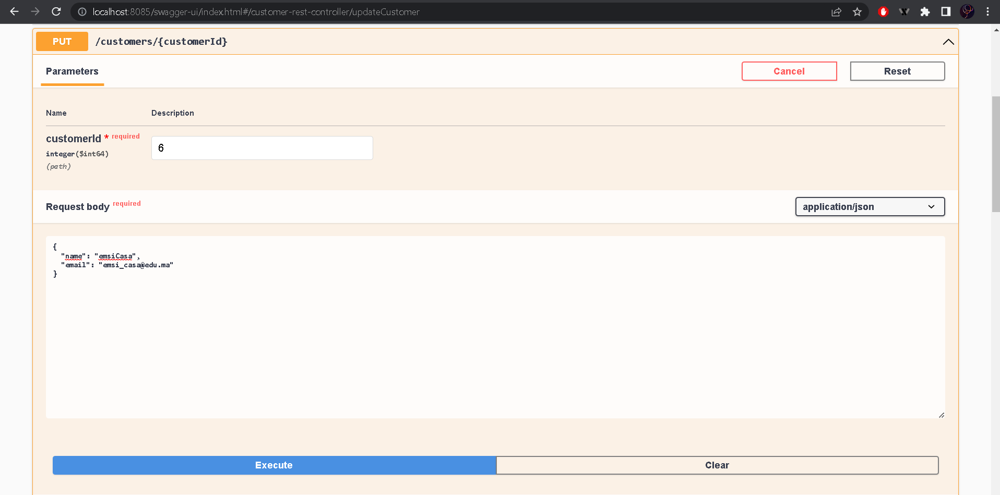
 
 
<h4>- Supprimer un client</h4>
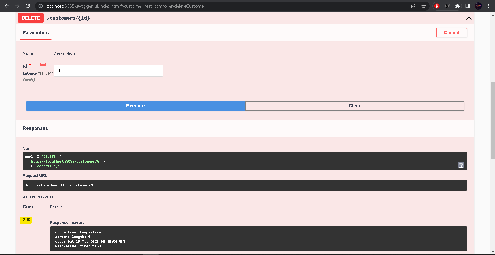
 
 
<h4>- BankAccountRestAPI.java</h4>
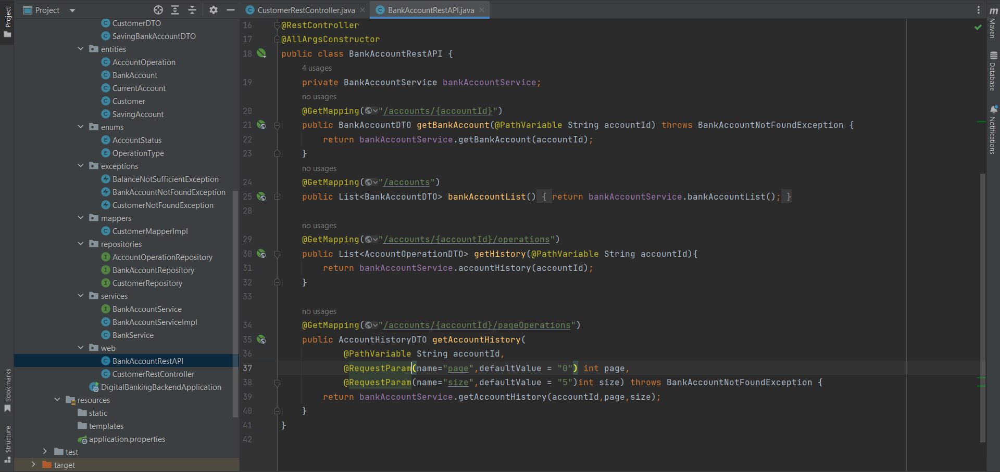
 
 
<h4>- Le Test de la couche web (BankAccount) :</h4>
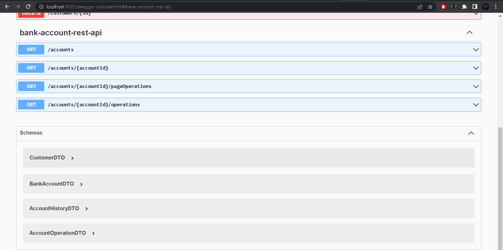
 
 
<h4>- Afficher les clients</h4>
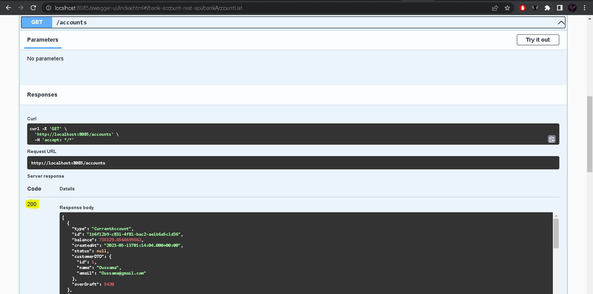
 
 
<h4>- Afficher les operations pour chaque compte</h4>
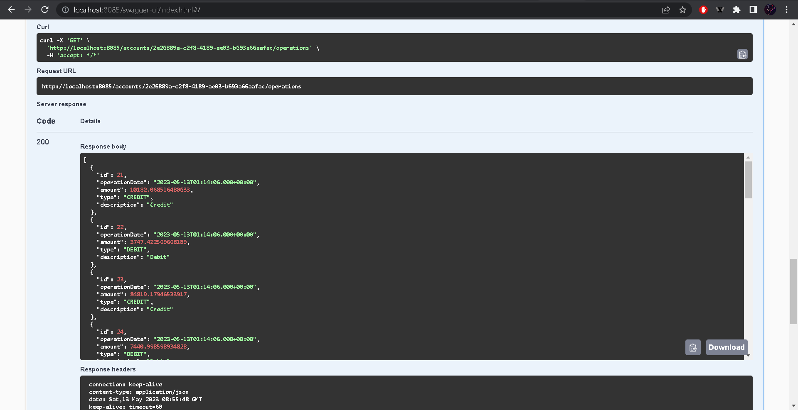
 
 
<h4>- Afficher les operations pour chaque compte avec la pagination</h4>

 

## Conclusion
L'architecture backend de l'application Digital Banking repose sur Spring Boot et suit une approche en couches pour une meilleure séparation des responsabilités. Les couches DAO, service et RestController travaillent ensemble pour permettre la gestion des comptes bancaires et la manipulation des données. Les entités JPA représentent les objets métier et sont mappées aux tables de la base de données. Les DTOs sont utilisés pour transférer les données entre les différentes couches de l'application.

L'utilisation de Spring Boot facilite le développement, la configuration et la gestion de l'application. De plus, l'utilisation des annotations telles que `@Entity`, `@Repository`, `@Service` et `@RestController` permet de définir clairement le rôle des différents composants de l'application.

En utilisant cette architecture, il est possible d'étendre l'application Digital Banking avec de nouvelles fonctionnalités et de maintenir un code clair et modulaire.
