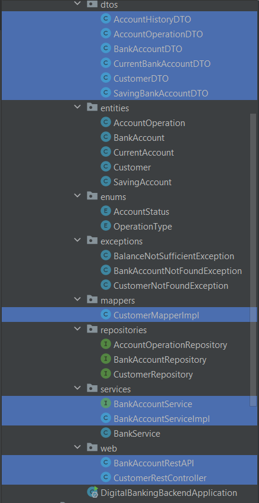
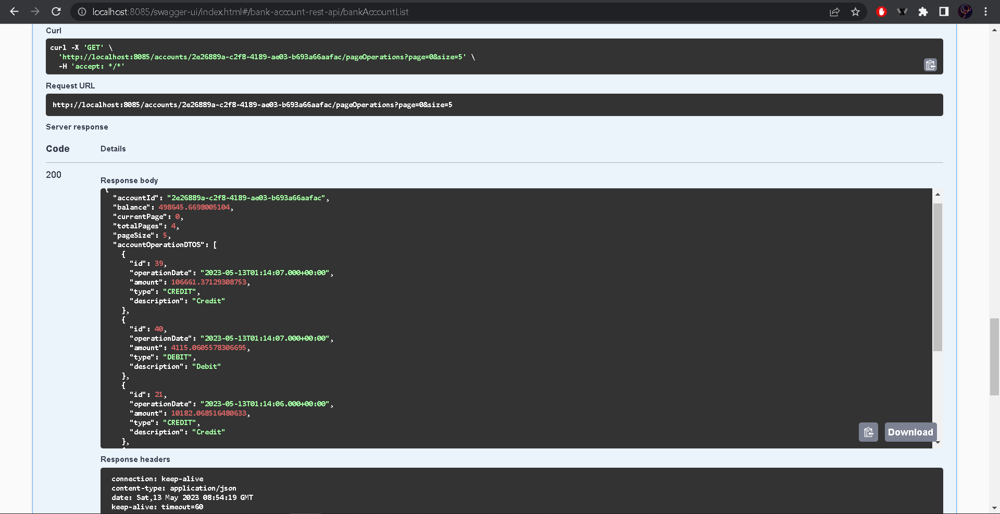

<h1>Spring Boot & Angular Digital Banking Application</h1>
 

      
Backend

    

<h2>
Ce fichier contient les trois parties du Projet
</h2>

 
 
<h3>
Partie 1 : Creation du projet
</h3>
 
<h4>- Use Case Diagram</h4>

 
     
<h4>- Le Test</h4>

 
 
<h4>- les entités et les interfaces JPA</h4>

 
 
 

 
<h3>
Partie 2 : Couche service, DTOs et RestController
</h3>
 
 
<h4>- Les couches (dtos, mappers, services, web) :</h4>

 
 
<h4>- BankAccountService.java</h4>

 
 
<h4>- CustomerRestController.java</h4>

 
 
<h4>- Le Test de la couche web (Customer) :</h4>

 
 
<h4>- Liste des clients</h4>

 
 
<h4>- Creer un client</h4>

 
 
<h4>- Modifier un client</h4>

 
 
<h4>- Supprimer un client</h4>

 
 
<h4>- BankAccountRestAPI.java</h4>

 
 
<h4>- Le Test de la couche web (BankAccount) :</h4>

 
 
<h4>- Afficher les clients</h4>

 
 
<h4>- Afficher les operations pour chaque compte</h4>

 
 
<h4>- Afficher les operations pour chaque compte avec la pagination</h4>

 
 
 

 
<h3>
Partie 3 : Client Angular :
</h3>
 
 
<h4></h4>

 
 
<h4></h4>

