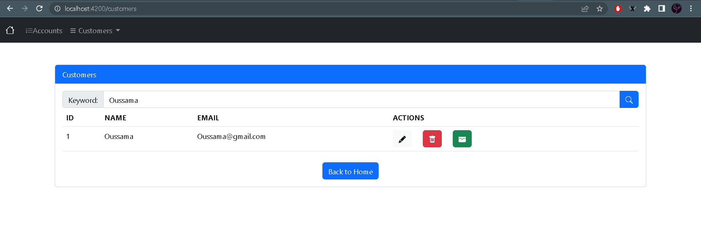
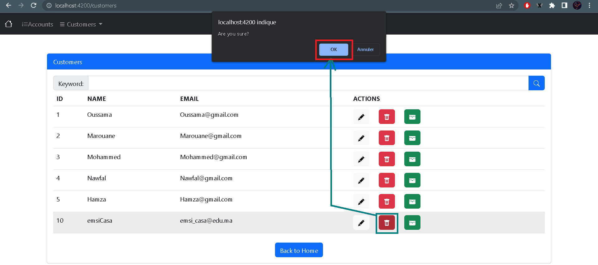
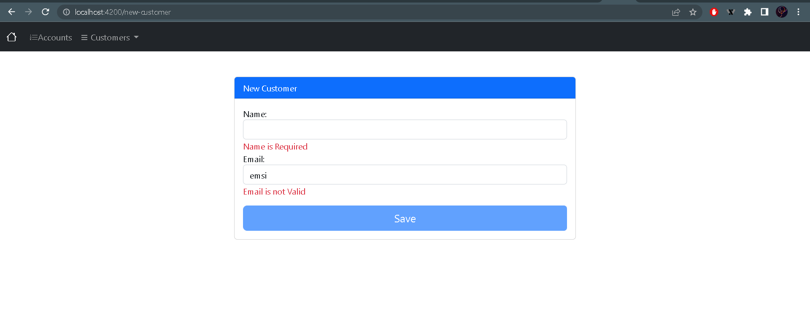
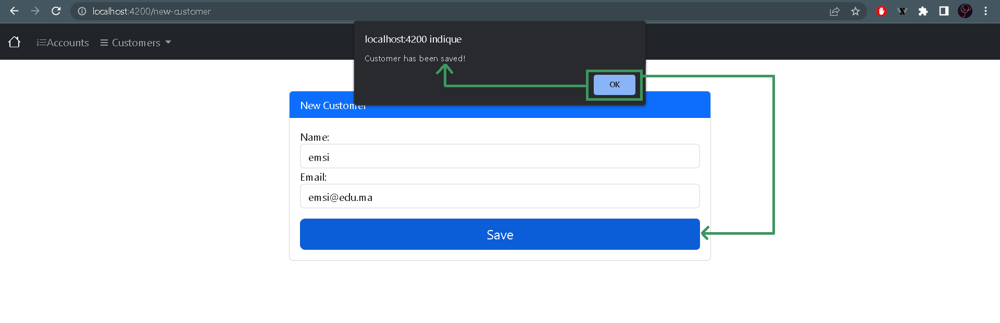
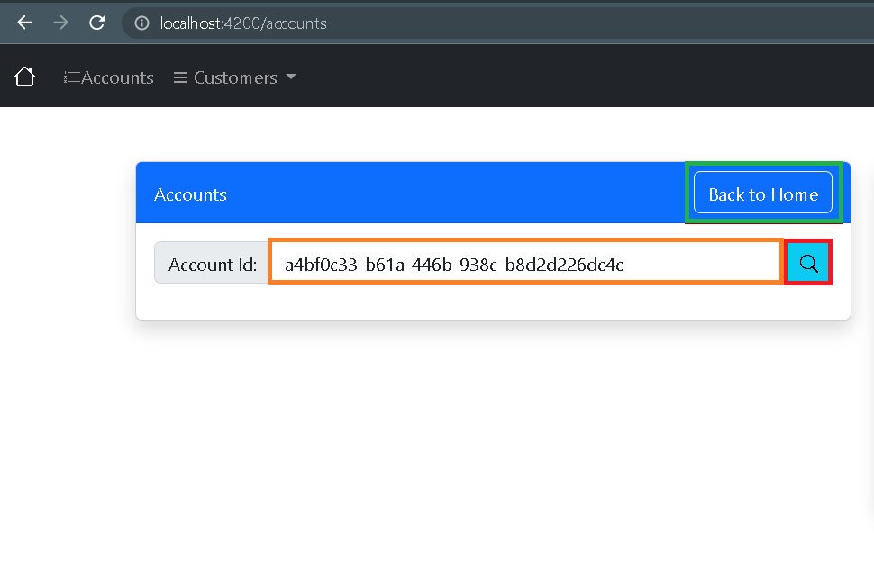
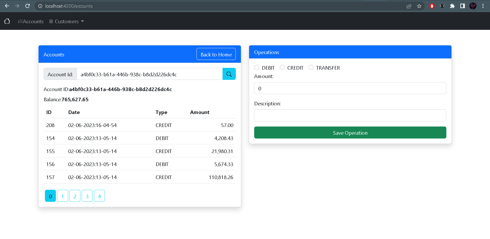
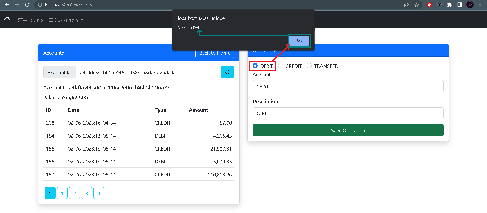
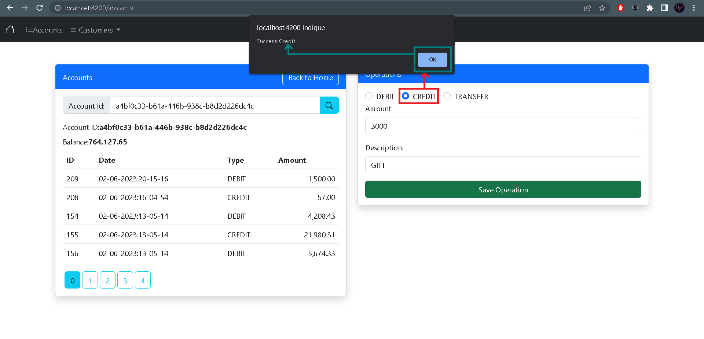
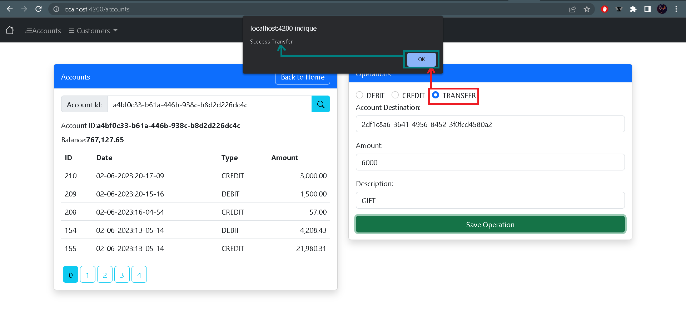
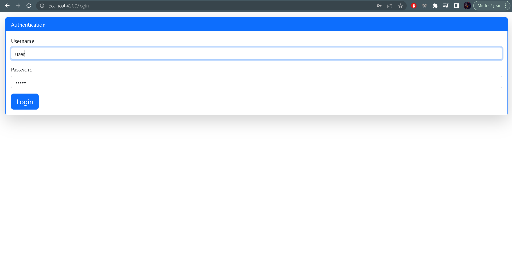

<h1 align="center">Partie Frontend de l'application web Digital Banking</h1>
<br>
<hr>
Ce rapport décrit la partie frontend de l'application web Digital Banking développée en utilisant le framework Angular. L'application propose différentes fonctionnalités pour gérer les opérations bancaires en ligne, y compris la consultation des comptes, la gestion des clients et les opérations financières telles que le débit, le crédit et le transfert.
<br>Cette architecture frontend avec une couche de sécurité JWT renforcée contribue à offrir une expérience utilisateur sécurisée et fiable 
<hr>


# L'authentification

Cette section représente un formulaire de connexion stylisé dans une carte avec des champs pour saisir le nom d'utilisateur et le mot de passe, ainsi qu'un bouton de connexion. Selon le type d'utilisateur authentifié (utilisateur "user" ou "admin"), des fonctionnalités spécifiques sont autorisées : l'utilisateur "user" peut consulter les clients et leurs opérations pour son compte, tandis que l'utilisateur "admin" a des droits étendus pour consulter, ajouter, modifier et supprimer des clients, ainsi que pour effectuer des transactions (débit, crédit, transfert).


<br>
<h1></h1>

<br>

<hr>

# ------------------- ADMIN ---------------------

<br>
<h1></h1>

<br>

## Interface Home

Cette section d'accueil présente un titre de bienvenue et deux boutons. Le premier bouton redirige vers la page de consultation des comptes bancaires, tandis que le deuxième bouton permet de vérifier les clients enregistrés.

<br>
<h1></h1>

<br>

L'interface principale de l'application est représentée par une section avec la classe CSS "home". Elle comprend les éléments suivants :

```html
<section class="home">
  <div class="container">
    <h2 class="title">Welcome to the Digital Banking App</h2>
    <div class="cta-buttons">
      <a class="btn btn-primary animated-button" routerLink="/accounts">
        <span class="button-text">Consult Your Bank Account</span>
        <span class="button-background"></span>
      </a>
      <a class="btn btn-secondary animated-button" routerLink="/customers">
        <span class="button-text">Check Customers</span>
        <span class="button-background"></span>
      </a>
    </div>
  </div>
</section>

```
# Partie Customers

La partie "Customers" est divisée en deux sections : la consultation des clients existants et l'ajout de nouveaux clients.

## 1.1- Consultation des clients

Cette section affiche la liste des clients existants. Elle comporte un champ de recherche permettant de filtrer les clients par mot clé. Chaque client est affiché dans un tableau avec les informations telles que l'ID, le nom et l'e-mail. Deux boutons sont disponibles pour supprimer le client ou accéder à ses comptes.

<br>


<br>

## 1.2- Recherche des clients par mot clé



<br>

## 1.3- Supprimer le client



<br>


## 1.4- Modifier le client


<br>


## 1.5- Ajout de nouveaux clients

Cette section permet d'ajouter de nouveaux clients à l'application. Un formulaire est affiché avec les champs requis tels que le nom et l'e-mail. Des validations sont effectuées sur les champs pour s'assurer que les données saisies sont correctes. L'utilisateur peut enregistrer le nouveau client en cliquant sur le bouton "Save".


<br>

### 1.1- les requis



<br>

### 1-2- l'ajout



<br>

# Comptes bancaires et opérations

La section des comptes bancaires permet de consulter les informations d'un compte spécifique et d'effectuer des opérations financières.




<br>


Cette section est divisée en deux parties :

- La première partie affiche les détails du compte bancaire spécifié, y compris l'ID du compte et le solde actuel. Elle liste également les opérations effectuées sur le compte, affichant leur ID, la date, le type et le montant.

- La deuxième partie permet à l'utilisateur d'effectuer des opérations financières sur le compte sélectionné. Il peut choisir entre les options de débit, de crédit et de transfert. Si l'option de transfert est sélectionnée, un champ supplémentaire pour spécifier le compte de destination s'affiche. L'utilisateur doit également saisir le montant et une description de l'opération. Ensuite, il peut enregistrer l'opération en cliquant sur le bouton correspondant.




<br>

## 1.1- DEBIT



<br>

## 1.2- CREDIT



<br>

## 1.3- TRANSFER



<br>

### - Nouvelle Historique des operations


<br>

# La base de donées


<br>


# ------------------- USER ---------------------

<br>
<h1></h1>

<br>

## Interface Home

Cette section d'accueil présente un titre de bienvenue et deux boutons. En tant qu'utilisateur, vous pouvez consulter vos comptes bancaires, mais l'accès aux informations détaillées des clients et aux actions avancées est restreint.

<br>
<h1></h1>

<br>

# Partie Customers

## 1.1- Consultation des clients


Dans cette section on affiche une liste de clients dans un tableau. Si l'utilisateur est un "user", il peut consulter la liste des clients, mais les actions avancées telles que l'édition, la suppression et l'accès aux comptes des clients ne sont pas disponibles pour lui.

<br>
<h1></h1>

<br>


# Comptes bancaires

Pour un utilisateur, cette section affiche un formulaire permettant de rechercher des comptes bancaires en utilisant leur ID. Les détails du compte bancaire sont affichés, y compris le solde et les opérations effectuées sur le compte. L'utilisateur peut également naviguer entre les pages des opérations et voir les détails de chaque opération.

Cependant, certaines fonctionnalités sont restreintes pour un utilisateur. Par exemple, la partie "Operations" qui permet d'effectuer des opérations (débit, crédit, transfert) et d'ajouter des opérations est réservée à l'administrateur.


<br>
<h1></h1>

<br>

# Conclusion

Ce rapport a décrit la partie frontend de l'application web Digital Banking développée en utilisant le framework Angular. L'interface utilisateur permet aux utilisateurs de consulter les clients enregistrés, d'ajouter de nouveaux clients, de consulter les détails des comptes bancaires, d'afficher les opérations effectuées et d'effectuer de nouvelles opérations financières telles que le débit, le crédit et le transfert. L'application offre une expérience conviviale pour gérer les opérations bancaires en ligne de manière efficace et sécurisée.

